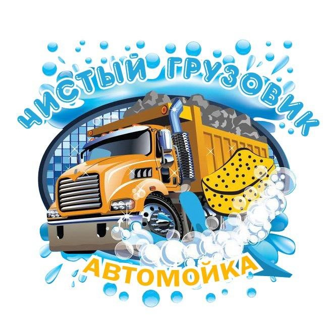

Скоро будет)

# Название проекта
CRM-система для автомойки спецтехники. Позволяет вести учёт заказов, персонала, контаргентов, типов и классов техники, автотранспорта, формировать необходимую документацию.

## Содержание
- [Технологии](#технологии)
- [Использование](#использование)
- [Тестирование](#тестирование)
- [Информация](#Информация)
- [To do](#to-do)
- [Команда проекта](#команда-проекта)

## Технологии
- [Python](https://www.python.org/)
- [Django](https://www.djangoproject.com/)
- [Django REST framework](https://www.django-rest-framework.org/)
- [Djoser](https://djoser.readthedocs.io/en/latest/getting_started.html)
- [Gunicorn](https://gunicorn.org/)
- [PyJWT](https://pyjwt.readthedocs.io/en/stable/)
- [Petrovich](https://pypi.org/project/Petrovich/)

## Использование
Проект работает в контейнерах docker. Для запуска проекта необходимы следующие действия:

Установите docker и docker-compose согласно [документации](https://docs.docker.com/compose/install/).
Клонируйте репозиторий:
```sh
git clone https://github.com/x9ilx/CRM_car_wash.git
```
Перейдите в каталог с проектом:
```sh
cd CRM_car_wash
```
Запустите сборку контейнеров:
```sh
docker-compose up --build
```
Контейнеры соберутся и запустятся. Автоматически применятся миграции, а так же будет БД будет заполнена тестовыми данными. Суперпользователь так же будет создан автоматически (исходя из переменных в .env файле).

Чтобы отключить автозаполнение и создание пользователя необходимо удалить/закомментировать следующие строчки, В файле backend/start_server.py:
```python
run_command('python manage.py loadbasedata')
```

## Тестирование
Проект проходил ручное тестирование группой пользователей.

После внедрения проекта, в течение недели, я следил за его работой, после чего, заказчик, оставил его работать на локальном сервере. Дальнейшая судьба неизвестна.

## Информация
Проект будет доступен по адресу 127.0.0.1 (localhost), на 80 порту. При разворачивании на сервере, по имени домена или ip сервера.

Для начала полноценной работы необходимо, через веб-интерфейс проекта, создать хотя бы одного сотрудника с ролью "Мойщик", иначе не выйдет создать заказ (не будут назначены мойщики)

### Зачем был разработан этот проект?
Это коммерческий проект, который разрабатывался в соответствии с подробными требованиями заказчика. Заказчик принял и внедрил первую версию проекта. 
Заказчик пропал, на момент Ноября 2024г., уже как на 6 месяцев )

## To do
- [x] Предоставить заказчик первую версию проекта, в соответствии с его требованиями.
- [ ] Дождаться появление заказчика )

## Команда проекта
- [Владимир Бондаренко](https://github.com/x9ilx/)